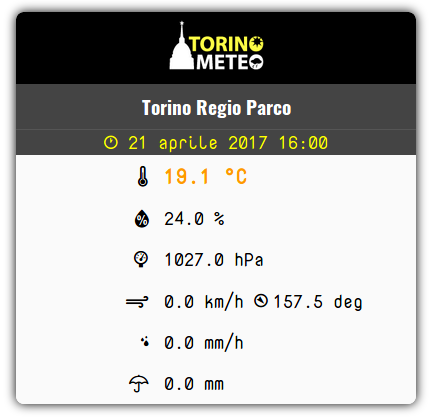
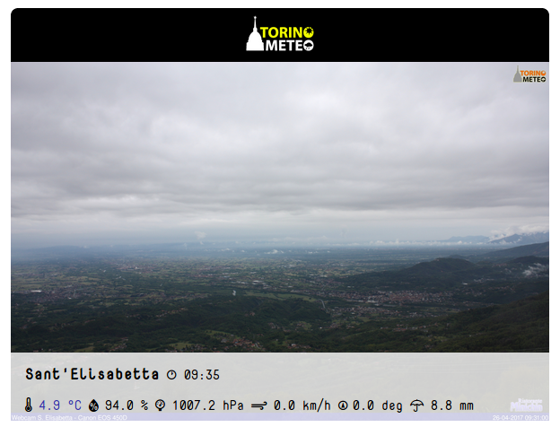

# tm-widgets



Libreria per l'inserimento di **widget responsive**  relativi alla rete di stazioni amatoriali TorinoMeteo in siti esterni.

Questa libreria è stata sviluppata per venire incontro agli utenti che non hanno dimestichezza o non hanno la possibilità di fruire direttamente
dei dati messi a disposizione tramite [web service](https://www.torinometeo.org/api-realtime/).

Questa libreria è stata sviluppata seguendo una linea guida principale: fornire un widget quanto più puro (non stilizzato) possibile.
Questo per permettere un elevato grado di personalizzazione e stilizzazione agli utenti. Forniremo poi degli snippet css già pronti per l'utilizzo,
come fossero dei temi, per facilitare ulteriormente gli utenti che non hanno bisogno di personalizzazioni elevate.

Questo significa che l'output di questa libreria è un html puro, con molte classi definite sugli elementi in modo da permettere una facile personalizzazione.

**NB**

Nelle immagini vedete widget personalizzati tramite file css che trovate nella directory `demo/css`, la libreria di per sè non setta alcuno stile (salvo qualche eccezione comunque sovrascrivibile)!

## Contenuti

* [Requirements](#requirements)
* [Utilizzo](#usage)
* [Esempio](#example)
* [Stili](#styles)
* [Screenshots](#screenshots)
* [Bug](#bug)
* [Sviluppo](#dev)

## <a name="requirements"></a>Requirements

tm-widgets richiede necessariamente una versione di jQuery >= 1.14 già caricata nella pagina. In caso contrario nessun widget verrà renderizzato e comparirà un errore nella console.

## <a name="usage"></a>Utilizzo

1. Includere jQuery nel documento, ad esempio
    ```
    <script
      src="https://code.jquery.com/jquery-2.2.4.min.js"
      integrity="sha256-BbhdlvQf/xTY9gja0Dq3HiwQF8LaCRTXxZKRutelT44="
      crossorigin="anonymous"></script>
    ```

2. Includere tm-widgets (il file `dist/tm-widgets.min.js`)
    ```
    <script src="path/to/dist/tm-widgets.min.js"></script>
    ```

3. Inserire all'interno della pagina come qualunque altro tag l'elemento `<tmrealtime station="id-stazione" />`

    ```
    <div class="bla bla">
      <tmrealtime type="default" station="torino-regio-parco" />
    </div>
    ```

Non è richiesto alcun ulteriore passaggio. La libreria provvederà a parserizzare il documento html (quando è pronto), e sostituirà i tag
`tmrealtime` con il widget opportuno.

## Attributi

Il tag `tmrealtime` può ricevere attributi che permettono di personalizzare il widget. Un solo attributo è obbligatorio: `station`,
perché definisce la stazione di riferimento per i dati

Vediamo quindi tutti gli attributi:

### station

Obbligatorio.

Rappresenta l'id della stazione di riferimento. Per sapere quali ID sono disponibili, fare riferimento al sito [torinometeo.org](https://www.torinometeo.org), nelle pagine di dettaglio delle stazioni, ad esempio [https://www.torinometeo.org/realtime/torino-regio-parco](https://www.torinometeo.org/realtime/torino-regio-parco) prendete la parte finale dell'url, in questo caso `torino-regio-parco`

### type

Opzionale.

Definisce la tipologia di widget, default: `'default'`.

|Tipologia|Descrizione|
|----------|---------------|
|default|Nome stazione e principali misure realtime|
|image|Nome stazione, temperatura e data rilevazione con immagine webcam o, se assente, immagine stazione.|

### Altri attributi

|Attributo|Descrizione|Tipologia|
|------------------|-----------|-----------------|
|`onReady`|Permette di definire una funzione (il nome della funzione anche con namespace se necessario, es 'window.miooggetto.miafunzione') che viene eseguita quando viene completata la renderizzazione del widget. Tale funzione riceverà come argomento l'oggetto jQuery wrapper del widget, e come contesto l'oggetto `window`|image, default|
|`datetimeFormat`|Opzionale. Formato del datetime dell'ultima rilevazione, default: GG mese AAAA HH:MM, esempio: 21 aprile 2017 10:34. I formati disponibili sono tutti quelli masticati da momentjs, e li trovate [qui](https://momentjs.com/docs/#/displaying/format/)|image, default|
|`forceImage`|Opzionale. Valori consentiti: true, false. Default: 'false'. Indica se forzare la visualizzazione dell'immagine anche se una webcam è presente.|image


Le etichette dei dati sono tutte personalizzabili come attributi. E' possibile anche utilizzare tag html, vedere nella directory demo ad esempio l'utilizzo di icone weathericons.

|Attributo|Descrizione|Tipologia|
|------------------|-----------|-----------------|
|`lastMeasureLabel`|Opzionale. Default: 'ultima rilevazione'|image, default|
|`temperatureLabel`|Opzionale. Default: 'temperatura'|image, default|
|`rhLabel`|Opzionale. Default: 'umidità relativa'|image, default|
|`pressureLabel`|Opzionale. Default: 'pressione'|image, default|
|`windLabel`|Opzionale. Default: 'vento'|image, default|
|`rainRateLabel`|Opzionale. Default: 'intensità precipitazioni'|default|
|`rainLabel`|Opzionale. Default: 'accumulo precipitazioni'|image, default|


## <a name="example"></a>Esempio

    <div class="widget-container">
      <tmrealtime
        lastMeasureLabel="<i class='wi wi-time-1'></i>"
        temperatureLabel="<i class='wi wi-thermometer'></i>"
        rhLabel="<i class='wi wi-humidity'></i>"
        pressureLabel="<i class='wi wi-barometer'></i>"
        windLabel="<i class='wi wi-strong-wind'></i>"
        rainRateLabel="<i class='wi wi-raindrops'></i>"
        rainLabel="<i class='wi wi-umbrella'></i>"
        station="torino-regio-parco"
        datetimeFormat="DD/MM/YY HH:mm"
        onReady="tmReady"
      />
    </div>

## <a name="styles"></a>Stili

Ogni elemento del widget è corredato da una o più classi css che vi permettono di ottenere una stilizzazione ottimale per il contesto in cui il widget sarà inserito. Inoltre ci sono alcune classi dinamiche (che dipendono dai valori):

- l'elemento che racchiude il valore di temperatura può avere una tra le seguenti classi: `tm-temp-cold` (t < 10), `tm-temp-warm` (10 <= t < 20), `tm-temp-hot` (t > 20)
- l'elemento che racchiude la direzione del vento può avere una tra le seguenti classi:
    - direction-up (337, 23]
    - direction-up-left (23, 68]
    - direction-left (68, 113]
    - direction-down-left (113, 158]
    - direction-down (158, 202]
    - direction-down-right (202, 248]
    - direction-right (248, 293]
    - direction-up-right (293, 337]

  Questo vi consente ad esempio di utilizzare icone di direzione (come fatto nella demo). Il significato degli intervalli (in gradi), qualora vi fosse oscuro, lo trovate [qui](https://it.wikipedia.org/wiki/Intervallo_(matematica))

## <a name="screenshots"></a>Screenshots

Default type


Image type




## <a name="bug"></a>Problemi, Bug

Se riscontrate malfunzionamenti, bug e quant'altro, riportateli nella pagina degli [issues](https://github.com/TorinoMeteo/tm-widgets/issues) cercando di fornire il maggior numero di informazioni possibile, soprattutto **sistema operativo** e **browser**, più eventuali output in console.

Tenete presente che questa libreria è stata sviluppata per browser moderni e che rispettano i normali standar web. Non intendo supportare browser obsoleti quali IE9, IE8 etc... (anche se non dovrebbero esserci grossi problemi)

## <a name="dev"></a>Sviluppo

Clonare il repository:

    git clone https://github.com/TorinoMeteo/tm-widgets.git

Installare le dipendenze

    $ cd tm-widgets
    $ npm install

Lanciare il server di sviluppo:

    $ npm run dev

Aprire il file `demo/basic.html` e switchare i commenti delle seguenti linee in modo da avere:

    <script src="/dist/tm-widgets.min.js"></script><!-- dev -->
    <!-- <script src="../dist/tm-widgets.min.js"></script> -->

A questo punto potete visitare http://localhost:8080/demo/basic.html

La pagina demo caricherà la libreria js compilata al volo da webpack. Ogni modifica alla libreria causerà una re-compilazione, quindi vi sarà
sufficiente ricaricare la pagina per vedere le modifiche.

Altri comandi:

|`npm run <script>`|Descrizione|
|------------------|-----------|
|`lint`|Controlla la sintassi del codice con `eslint`.|
|`clean`|Elimina la directory `dist`.|
|`dev`|Serve la libreria all'indirizzo http://localhost:8080/dist/tm-widgets.min.js.|
|`compile`|Compila la libreria (`~/dist` by default).|
|`deploy`|Esegue lint, clean e compila la libreria con profilo "produzione".|
